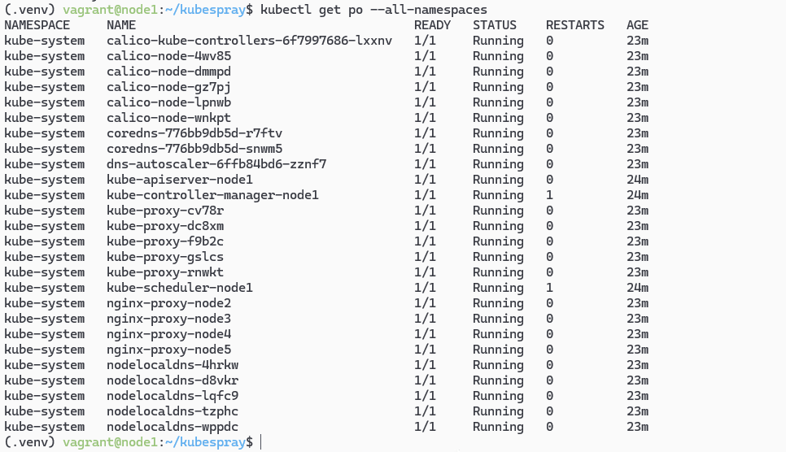

# Домашнее задание к занятию «Установка Kubernetes» - Сергей Михалёв

### Цель задания

Установить кластер K8s.

### Чеклист готовности к домашнему заданию

1. Развёрнутые ВМ с ОС Ubuntu 20.04-lts.

### Инструменты и дополнительные материалы, которые пригодятся для выполнения задания

1. [Инструкция по установке kubeadm](https://kubernetes.io/docs/setup/production-environment/tools/kubeadm/create-cluster-kubeadm/).
2. [Документация kubespray](https://kubespray.io/).

-----

### Задание 1. Установить кластер k8s с 1 master node

1. Подготовка работы кластера из 5 нод: 1 мастер и 4 рабочие ноды.
2. В качестве CRI — containerd.
3. Запуск etcd производить на мастере.
4. Способ установки выбрать самостоятельно.

**Решение**

Для установки кластера я выбрал Kubespray.

Согласно плану установки, озвученному на занятии, использовал утилиту *ruamel.yaml* для автоматического создания *inventory* файла.

Результат проверки доступности всех хостов, участвующих в создании кластера 

Результат запуска сборки  
`ansible-playbook -i inventory/mycluster/hosts.yaml cluster.yml -u vagrant --extra-vars "ansible_password=vagrant" -b -v &` 

Список полученных нодов  
`ansible-playbook -i inventory/mycluster/hosts.yaml cluster.yml -u vagrant --extra-vars "ansible_password=vagrant" -b -v &` 

Список ресурсов кластера  
`ansible-playbook -i inventory/mycluster/hosts.yaml cluster.yml -u vagrant --extra-vars "ansible_password=vagrant" -b -v &` 

